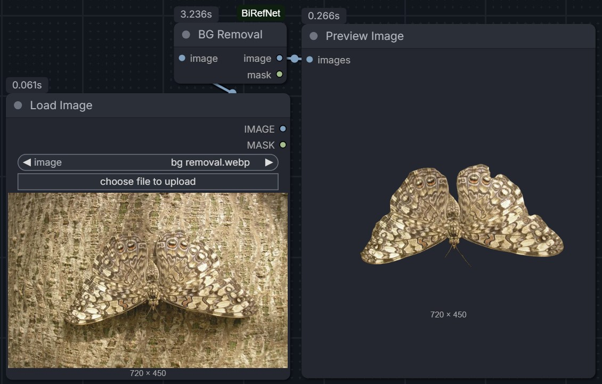

# ComfyUI-BiRefNet

A simple ComfyUI custom node for background removal using the [BiRefNet](https://huggingface.co/ZhengPeng7/BiRefNet) model.



## Features
- **High-Quality Background Removal**: Powered by BiRefNet.
- **Auto-Download**: Automatically downloads the necessary model files from HuggingFace on first run.
- **RGBA Output**: Returns both the image with transparency and the corresponding mask.

## Installation

1. Navigate to your ComfyUI `custom_nodes` directory:
   ```bash
   cd ComfyUI/custom_nodes/
   ```
2. Clone this repository:
   ```bash
   git clone https://github.com/MohammadAboulEla/ComfyUI-BiRefNet.git
   ```
3. Restart ComfyUI.

## Nodes

### BG Removal (BiRefNet)
- **Inputs**: 
  - `image`: The input image to process.
- **Outputs**:
  - `image`: The processed image with the background removed (RGBA).
  - `mask`: The generated alpha mask.

## Weights
The node automatically downloads the `model.safetensors` from [ZhengPeng7/BiRefNet](https://huggingface.co/ZhengPeng7/BiRefNet) into `ComfyUI/models/BiRefNet/`.

## Credits
Based on the research and model by [ZhengPeng7](https://github.com/ZhengPeng7/BiRefNet).
